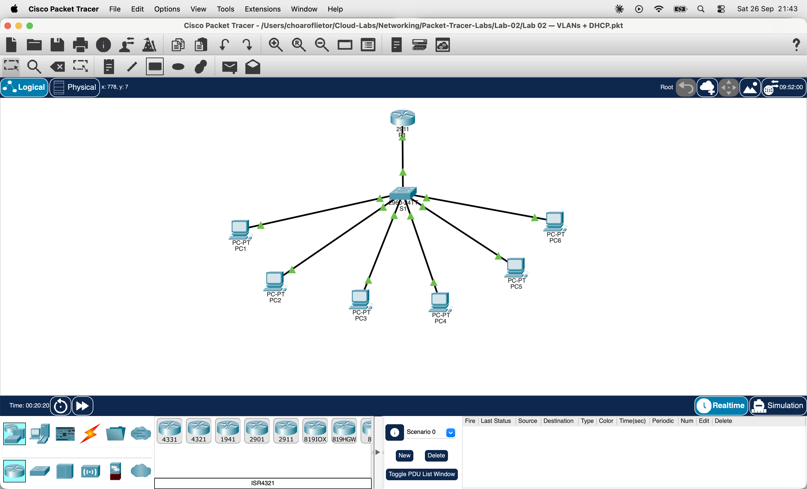

# Lab 02 — VLANs + DHCP (Router-on-a-Stick)

## Topology

## Objective
Build on Lab 01 by adding DHCP so PCs receive IP addresses automatically instead of manually. The router acts as both the inter-VLAN router and the DHCP server.

## Network Design

| VLAN | Name           | Network          | Gateway        | DHCP Pool |
|------|----------------|------------------|----------------|-----------|
| 10   | Administration | 192.168.10.0/24  | 192.168.10.1   | VLAN10    |
| 20   | Sales          | 192.168.20.0/24  | 192.168.20.1   | VLAN20    |
| 30   | IT             | 192.168.30.0/24  | 192.168.30.1   | VLAN30    |

## Devices
- 1 x Cisco 2911 Router (R1)
- 1 x Cisco 2960 Switch (S1)
- 6 x PCs (2 per VLAN)

## Configuration Summary

### Switch (S1)
- VLANs 10, 20, 30 created
- Fa0/1-2 → VLAN 10 (access)
- Fa0/3-4 → VLAN 20 (access)
- Fa0/5-6 → VLAN 30 (access)
- Fa0/7 → trunk to router

### Router (R1) — Subinterfaces
- G0/0.10 — encapsulation dot1Q 10 — 192.168.10.1
- G0/0.20 — encapsulation dot1Q 20 — 192.168.20.1
- G0/0.30 — encapsulation dot1Q 30 — 192.168.30.1

### Router (R1) — DHCP Pools
- ip dhcp excluded-address 192.168.10.1
- ip dhcp excluded-address 192.168.20.1
- ip dhcp excluded-address 192.168.30.1

ip dhcp pool VLAN10
- network 192.168.10.0 255.255.255.0
- default-router 192.168.10.1
- dns-server 8.8.8.8

ip dhcp pool VLAN20
- network 192.168.20.0 255.255.255.0
- default-router 192.168.20.1
- dns-server 8.8.8.8

ip dhcp pool VLAN30
- network 192.168.30.0 255.255.255.0
- default-router 192.168.30.1
- dns-server 8.8.8.8

## DHCP Bindings Verified
| IP Address     | VLAN | Type      |
|----------------|------|-----------|
| 192.168.10.2   | 10   | Automatic |
| 192.168.10.3   | 10   | Automatic |
| 192.168.20.2   | 20   | Automatic |
| 192.168.20.3   | 20   | Automatic |
| 192.168.30.2   | 30   | Automatic |
| 192.168.30.3   | 30   | Automatic |

## Result
✅ All PCs received IP addresses automatically via DHCP.
✅ Inter-VLAN communication successful across all three VLANs.

## Key Concept
The router excludes its own gateway IPs from the DHCP pool so they are never assigned to a PC. Every other address in the range is available for automatic assignment.

## Tools Used
Cisco Packet Tracer