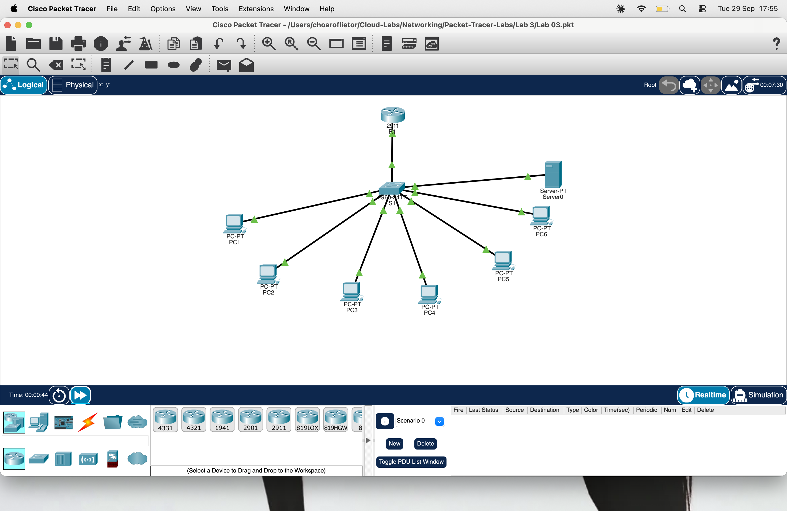

# Lab 03 — Access Control Lists (ACLs)

## Topology

## Objective
Apply standard and extended ACLs to a router-on-a-stick network with DHCP to control which VLANs can communicate and on which services.

## Network Design

| VLAN | Name           | Network          | Gateway        | Hosts                              |
|------|----------------|------------------|----------------|------------------------------------|
| 10   | Administration | 192.168.10.0/24  | 192.168.10.1   | .2, .3 (DHCP)                      |
| 20   | Sales          | 192.168.20.0/24  | 192.168.20.1   | .2, .3 (DHCP)                      |
| 30   | IT             | 192.168.30.0/24  | 192.168.30.1   | .2, .3 (DHCP); Server .10 (static) |

## Security Policy

| Source | Policy |
|--------|--------|
| Sales  | No access to Administration. HTTP and ping to web server only. No other IT access. |
| IT     | May reach Administration. May not initiate traffic to Sales. |

## ACL Configuration

### SALES_IN (applied inbound on G0/0.20)

ip access-list extended SALES_IN
deny ip 192.168.20.0 0.0.0.255 192.168.10.0 0.0.0.255
permit tcp 192.168.20.0 0.0.0.255 host 192.168.30.10 eq www
permit icmp 192.168.20.0 0.0.0.255 host 192.168.30.10 echo
deny ip 192.168.20.0 0.0.0.255 192.168.30.0 0.0.0.255
permit ip any any

### IT_IN (applied inbound on G0/0.30)
ip access-list extended IT_IN
permit icmp host 192.168.30.10 192.168.20.0 0.0.0.255 echo-reply
permit tcp host 192.168.30.10 eq www 192.168.20.0 0.0.0.255 established
deny ip 192.168.30.0 0.0.0.255 192.168.20.0 0.0.0.255
permit ip any any

## Test Results

| Test                          | Expected | Result |
|-------------------------------|----------|--------|
| Sales → Administration (ping) | Fail     | ✅ Fail |
| Sales → Server ping           | Pass     | ✅ Pass |
| Sales → Server HTTP           | Pass     | ✅ Pass |
| Sales → IT PC (192.168.30.2)  | Fail     | ✅ Fail |
| IT PC → Administration        | Pass     | ✅ Pass |
| IT PC → Sales                 | Fail     | ✅ Fail |

## Fault Found & Fixed
**Symptom:** Sales could not ping or browse the web server even though SALES_IN permitted those requests.

**Root cause:** ACLs are stateless. The server's reply packets entered G0/0.30 inbound and hit IT_IN's deny rule before they could reach Sales.

**Fix:** Added two rules above the deny in IT_IN:
- `permit icmp echo-reply` — allows ping replies from the server back to Sales
- `permit tcp established` — allows HTTP return traffic from the server back to Sales

## Key Concepts Learned
- Standard ACLs match source only — place near the destination
- Extended ACLs match source, destination, and port — place near the source
- ACLs are **stateless** — return traffic must be explicitly permitted
- `permit ip any any` at the end of each ACL keeps DHCP working
- Single-host ACL lines with DHCP depend on current leases — use static IPs or reservations for servers

## Tools Used
Cisco Packet Tracer