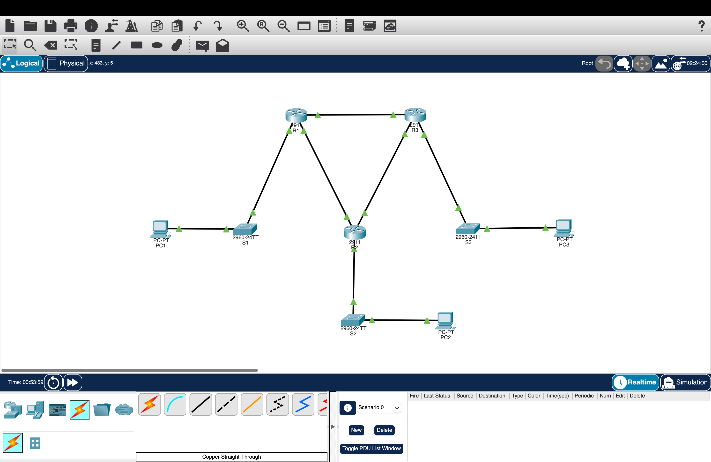

# Lab 04 — OSPF Dynamic Routing

## Topology


## Objective
Replace manual routing with OSPF. Three routers connect three sites in a triangle and automatically share their networks, so every site can reach every other site.

## Network Design

| Site | Router | LAN Network    | Gateway     | PC            |
|------|--------|----------------|-------------|---------------|
| 1    | R1     | 192.168.1.0/24 | 192.168.1.1 | 192.168.1.10  |
| 2    | R2     | 192.168.2.0/24 | 192.168.2.1 | 192.168.2.10  |
| 3    | R3     | 192.168.3.0/24 | 192.168.3.1 | 192.168.3.10  |

### WAN Links

| Link   | Network      | Side A         | Side B         |
|--------|--------------|----------------|----------------|
| R1—R2  | 10.0.12.0/30 | R1: 10.0.12.1  | R2: 10.0.12.2  |
| R2—R3  | 10.0.23.0/30 | R2: 10.0.23.1  | R3: 10.0.23.2  |
| R1—R3  | 10.0.13.0/30 | R1: 10.0.13.1  | R3: 10.0.13.2  |

## Devices
- 3 x Cisco 2911 Routers (R1, R2, R3)
- 3 x Cisco 2960 Switches (S1, S2, S3)
- 3 x PCs (1 per site)

## Configuration Summary

### Router Interfaces

| Router | G0/0 (LAN)       | G0/1                   | G0/2                   |
|--------|------------------|------------------------|------------------------|
| R1     | 192.168.1.1/24   | 10.0.12.1/30 (to R2)   | 10.0.13.1/30 (to R3)   |
| R2     | 192.168.2.1/24   | 10.0.12.2/30 (to R1)   | 10.0.23.1/30 (to R3)   |
| R3     | 192.168.3.1/24   | 10.0.13.2/30 (to R1)   | 10.0.23.2/30 (to R2)   |

### OSPF Configuration
- OSPF process 1, all networks in area 0
- Each router advertises its LAN and its two WAN links
- Router IDs were not set manually. Each router used its highest interface IP: R1 192.168.1.1, R2 192.168.2.1, R3 192.168.3.1

**R1**
```
router ospf 1
 log-adjacency-changes
 network 192.168.1.0 0.0.0.255 area 0
 network 10.0.12.0 0.0.0.3 area 0
 network 10.0.13.0 0.0.0.3 area 0
```

**R2**
```
router ospf 1
 log-adjacency-changes
 network 192.168.2.0 0.0.0.255 area 0
 network 10.0.12.0 0.0.0.3 area 0
 network 10.0.23.0 0.0.0.3 area 0
```

**R3**
```
router ospf 1
 log-adjacency-changes
 network 192.168.3.0 0.0.0.255 area 0
 network 10.0.23.0 0.0.0.3 area 0
 network 10.0.13.0 0.0.0.3 area 0
```

## Verification & Testing

Commands used:
```
show ip ospf neighbor
show ip route
show running-config
ping
```

### OSPF Neighbors
All adjacencies are in the FULL state:

| Router | Neighbors                          | State |
|--------|------------------------------------|-------|
| R1     | 192.168.2.1 (R2), 192.168.3.1 (R3) | FULL  |
| R2     | 192.168.1.1 (R1), 192.168.3.1 (R3) | FULL  |
| R3     | 192.168.1.1 (R1), 192.168.2.1 (R2) | FULL  |

### Routes Learned via OSPF

| Router | OSPF routes                                  |
|--------|----------------------------------------------|
| R1     | 192.168.2.0/24, 192.168.3.0/24, 10.0.23.0/30 |
| R2     | 192.168.1.0/24, 192.168.3.0/24, 10.0.13.0/30 |
| R3     | 192.168.1.0/24, 192.168.2.0/24, 10.0.12.0/30 |

All learned routes show `[110/2]` (administrative distance 110, cost 2).

### End-to-End Ping from PC1

| Test                       | Result                                    |
|----------------------------|-------------------------------------------|
| PC1 → PC2 (192.168.2.10)   | 1st ping 25% loss (ARP), 2nd ping 0% loss |
| PC1 → PC3 (192.168.3.10)   | 1st ping 25% loss (ARP), 2nd ping 0% loss |

The first-ping loss is ARP resolution on the first packet and is normal in Packet Tracer.

## Key Takeaways
- OSPF removes the need for static routes: routers discover each other and share networks automatically.
- `network` statements use wildcard masks (`0.0.0.255` for /24, `0.0.0.3` for /30).
- R1 reaches 10.0.23.0/30 through both R2 and R3 at equal cost, so OSPF installs both paths.
- The triangle gives redundancy: if one WAN link fails, traffic can reroute over the other path.

## Possible Improvements
- Make the LAN interfaces `passive-interface` so OSPF hellos are not sent toward PCs.
- Set a `router-id` manually, or use a loopback, so router IDs stay stable if interface addresses change.

## Tools Used
Cisco Packet Tracer